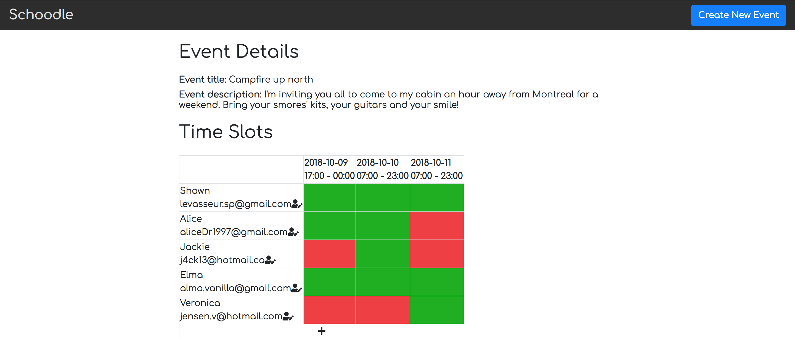

# Node Skeleton

A simple doodle clone for you and your friends to organize an event with multiple time possibilities.

## Getting Started

1. Create the `.env` by using `.env.example` as a reference: `cp .env.example .env`
2. Update the .env file with your correct local information
3. Install dependencies: `npm i`
4. Fix to binaries for sass: `npm rebuild node-sass`
5. Run migrations: `npm run knex migrate:latest`
  - Check the migrations folder to see what gets created in the DB
6. Run the seed: `npm run knex seed:run`
  - Check the seeds file to see what gets seeded in the DB
7. Run the server: `npm run local`
8. Visit `http://localhost:8080/`

## Dependencies

- Node 5.10.x or above
- NPM 3.8.x or above
- Body-parser 1.15.2 or above
- Dotenv 2.0.0 or above
- Ejs 2.4.1 or above
- Express 4.13.4 or above
- Knex 0.11.7 or above
- Knex-logger 0.1.0 or above
- Morgan 1.7.0 or above
- Node-sass-middleware 0.9.8 or above
- Pg 6.0.2 or above

## Screenshots

